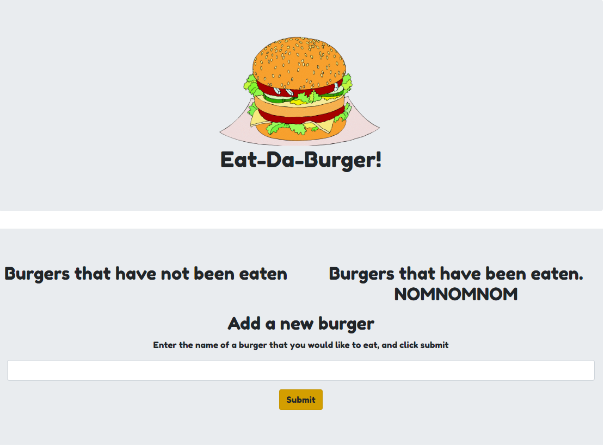
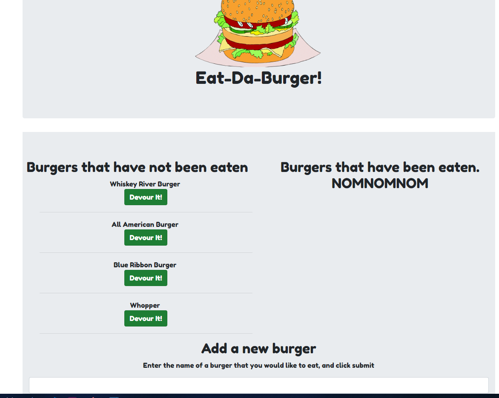
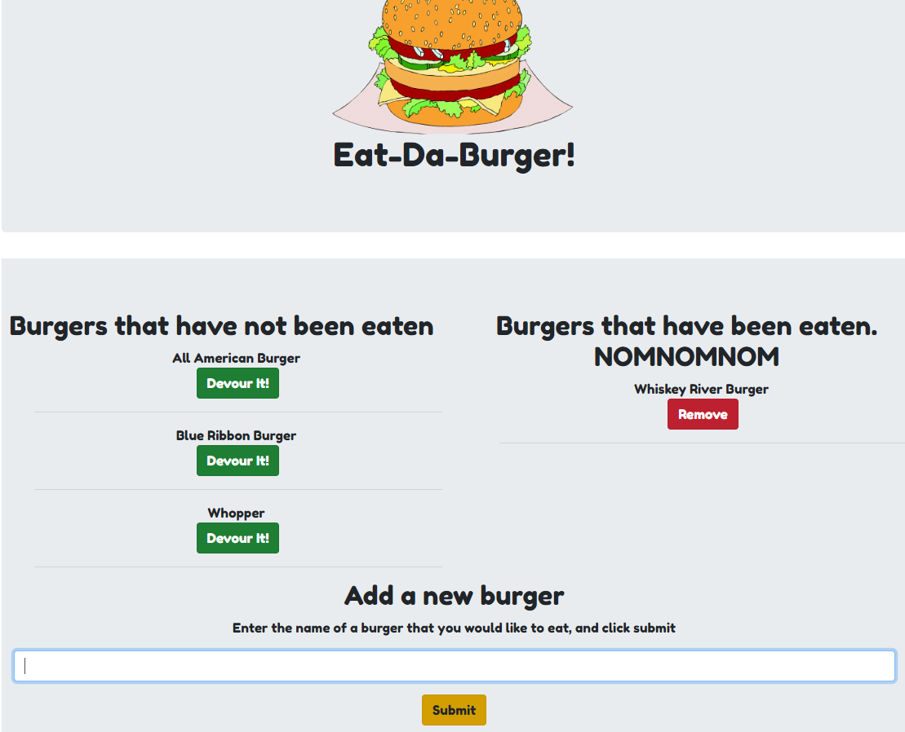
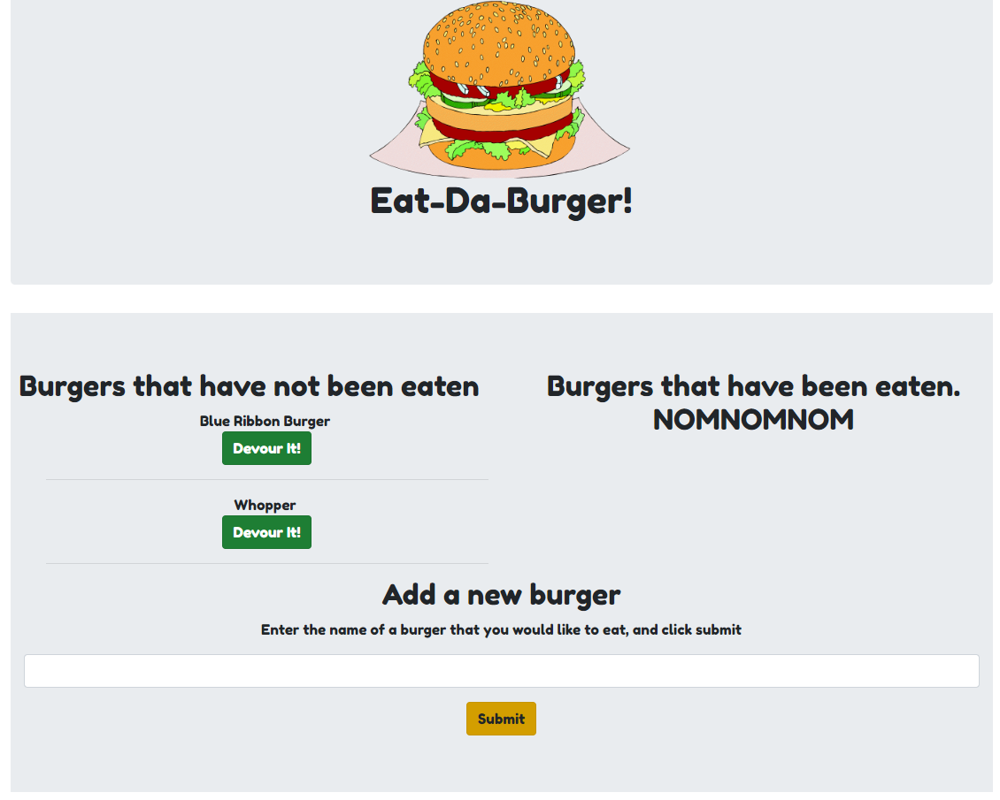
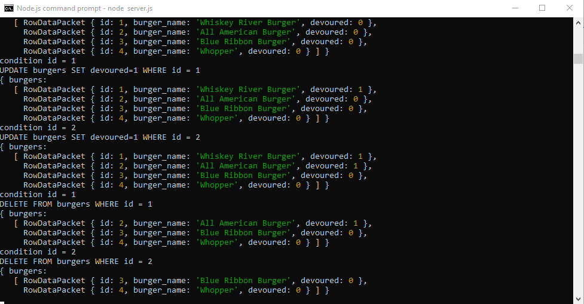

# Burger

## "Burger" is an app that utilizes: 
1. mySql
1. express
1. node.js
1. handlebars.js
1. ORMs 

### This application is deployed on Heroku, which you can test out the application [here](https://shielded-beyond-99285.herokuapp.com)

### Here is the app at start-up 

### Here is the app after burgers have been created via submit

### Here is the app after burgers have been updated to be "devoured"

### Here is the app after burgers have been deleted

### This screenshot shows what is happening on the command line

